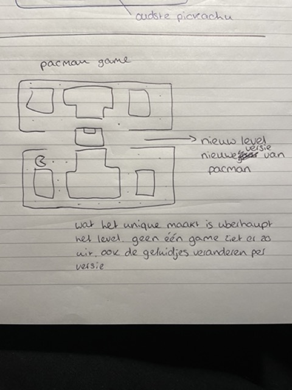
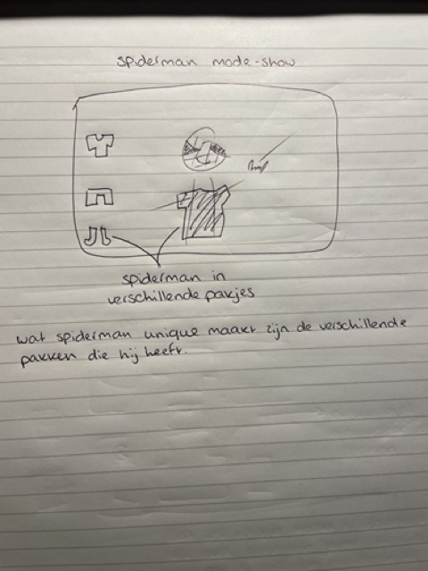
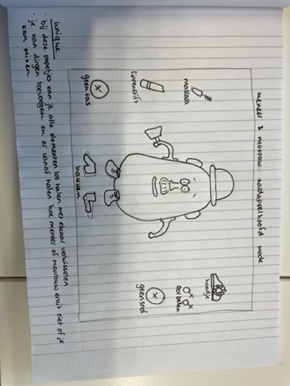
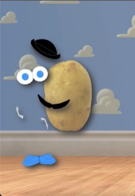
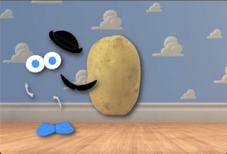
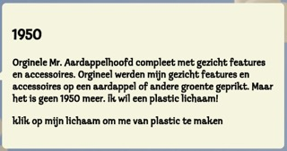
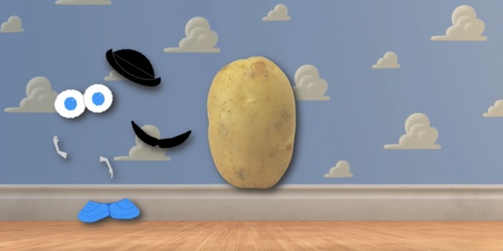
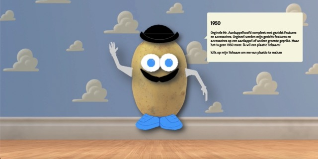
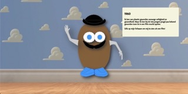
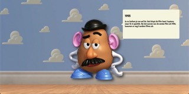

# Procesverslag
Markdown is een simpele manier om HTML te schrijven.  
Markdown cheat cheet: [Hulp bij het schrijven van Markdown](https://github.com/adam-p/markdown-here/wiki/Markdown-Cheatsheet).

Nb. De standaardstructuur en de spartaanse opmaak van de README.md zijn helemaal prima. Het gaat om de inhoud van je procesverslag. Besteedt de tijd voor pracht en praal aan je website.

Nb. Door *open* toe te voegen aan een *details* element kun je deze standaard open zetten. Fijn om dat steeds voor de relevante stuk(ken) te doen.

## Jij

### Ontwerper:
Sarah Gieben

#### Je startniveau:
Blauw

# Je plan

  
De eerste versie/schets van je ontwerp & je persoonlijke uitdaging

  ### De eerste versie/schets:
  
  
  

  ### Mijn idee en kenmerken van mijn karakter:
  Mijn idee voor deze opdracht is uiteindelijk meneer en mevrouw aardappelhoofd geworden. Je kan dan interacteren met het karakter door zijn ledenmate, ogen, accessoires er af te halen, er weer op te zetten. Zo kan je dingen mixen, niet gebruiken

  ### Je ambitie: 
  Aan deze technieken/punten wil ik werken:
  - Ik wil gewoon uberhaupt een beetje beter worden in vooral html css. Als dat me lukt misschien iets meer ook js. Omdat ik daar allemaal nog niet zo goed in ben, vooral in js.
  - Ik wil de lat voor mezelf eerst niet te hoog leggen. Want dat heb ik vaak met code opdrachten gedaan waardoor ik het niet optijd af kreeg. Als eerste is mijn doel om een werkende interactie site te bouwen en daarna pas leuke extra's toevoegen als ik daar nog tijd voor heb.
  - Ook code die ik regelmatig moet gebruiken zoals plaatsing van elementen, het responsive maken etc. dat wil ik een beetje beter uit mijn hoofd kunnen doen.
  - Met deze opdracht hoop ik als laatste gewoon een beetje meer plezier te kunnen hebben in de opdracht. Vaak met code opdrachten, omdat ik er niet zo goed in ben, heb ik als designer een geweldig idee in mijn hoofd hoe ik de opdracht wil hebben maar dan raak ik gestrest omdat ik het niet zo in code kan krijgen als dat ik het in mijn hoofd heb. Dus ik hoop er iets meer plezier uit te kunnen halen.
 

## Voortgang/Feedback 1

  

    Mijn bevindingen + wijzigingen (minimaal 5)
  

  ### Bevinding 1:
  
  Als eerste mijn Pacman schets. De schets was nog teveel een 'schets', net zoals het idee. Het leek me een moeilijk idee om te realiseren. Wel vond ik dat de iconische pacman geluidjes door de jaren heen erg leuk hadden geweest.

  #### oplossing:
  Een nieuw idee verzinnen.

  ### Bevinding 2:
  
  Ook mijn spiderman schets was teveel een 'schets'. Het idee vond ik een goed idee omdat het echt iets karakteristieks is van spiderman. Alleen ik had het idee niet zelf bedacht.

  #### oplossing:
  Een nieuw idee verzinnen.

  ### Bevinding 3:
  
  Mijn oplossing was dus een nieuw idee verzinnen en daarvoor ook betere schetsen maken. Dit is uiteindelijk mijn nieuwe idee geworden die ik ga maken. Het was een goed idee. Ik moest wel nog nadenken over de tijdlijn en nog wat meer interactie dingen toevoegen.

  #### oplossing:
  
  Wat meer interactie dingen zoals bijvoorbeeld wanneer meneer hakken aan krijgt van meevrouw dan wordt hij boos, omdat hij niet op hakken kan lopen.

  ### Bevinding 4:
  Nadenken over welke html elementen ik wellicht zou moeten gaan gebruiken in dit project.
  
  #### oplossing:
  
  op deze afbeelding kan je nog zien dat ik dat met podlood erbij heb gezet.

  ### Bevinding 5:
  Research doen naar meneer aardappelhoofd.

  #### oplossing:
  Voor mijn research heb ik oude commercials bekeken van het speelgoed. Ik heb ook gekeken naar de verschillende varianten door de jaren heen en natuurlijk naar Mr. en Mrs. Potatohead in de film Toystory.

## Voortgang/Feedback 2

  
Mijn bevindingen + wijzigingen (minimaal 5)

  
  ### Bevinding 1:
  Meer responsivness in mijn site. De site schaalde niet goed mee

  #### oplossing:
  
  
  Ik heb samen met Sanne mijn site kunnen aanpassen dat de buttons mee gaan met de windowsize. Ook de aardappel schaalt beter mee dan voorheen.

 
  ### Bevinding 2:
  Ik moest nog fonts toevoegen op mijn site.

  #### oplossing:
  
  Dit heb ik snel en makkelijk kunnen doen. Ik heb het font van Mr. Potatohead opgezocht en gedownload. Die heb ik uiteindelijk in mijn code gezet.

  ### Bevinding 3:
  Ik moest nog aan mijn interactieve elementen werken om die werkend te maken.

  #### oplossing:
  Dit is uiteindelijk gelukt met behulp van klasgenoten, docent en studentassistent.

  ### Bevinding 4:
  Ik moest nog wat meer structuur brengen in mijn css.

  #### oplossing:
  Dit heb ik gedaan door dingen erbij te commenten.

  ### Bevinding 5:
  Bij mijn javascript kon ik ook nog wat meer comments bij zetten.

  #### oplossing:
  Dit heb ik ook gedaan door dingen bij de javascript te commenten.

## Voortgang/Feedback 3

  
Mijn bevindingen + wijzigingen (minimaal 5)

  
  ### Bevinding 1:
  Als ik nog tijd heb de afbeeldingen overtrekken met illustrator.

  #### oplossing:
  De afbeeldingen zijn helaas nog een beetje pixelachtig. Dit had ik graag nog willen veranderen, maar ik heb daar helaas geen tijd meer voor gehad.

  ### Bevinding 2:
  Als ik tijd heb states op de ledenmaten erop zetten.

  #### oplossing:
  Ik heb een hover en een focus state op de ledenmate gezet, zodat het beter duidelijk wordt dat je erop kan klikken. Ook werkt de focus voor mensen die alleen een toetsenbord gebruiken.

  ### Bevinding 3:
  Kleuren in mijn root zetten.

  #### oplossing:
  Ik moest nog kleuren in mijn root zetten. Dit ging gelukkig makkelijk.

  ### Bevinding 4:
  Als ik tijd heb mijn selectoren in volgorde zetten.

  #### oplossing:
  Hier heb ik helaas geen tijd meer voor gehad.

  ### Bevinding 5:
  Mijn bronnen in mijn readme zetten.

  #### oplossing:
  Ik moest mijn gebruikte bronnen nog even in mijn readme zetten. Die kun je hier onderaan vinden:).

  ### Bevinding 6:
  Mijn aardappel nog werkend maken.  

  #### oplossing:
  De laatste fase van mijn aardappel (die met toystor) werkte nog niet helemaal. Uiteindelijk was het niet zo moeilijk in javascript. Maar het duurde wel even voordat het echt werkte.

## Reflectie

  
Mijn eindresultaat & persoonlijke ontwikkeling

  ### Je uitkomst - karakteristiek screenshot(s):
 
  
  
  
  
  
  

  ### Dit ging goed/Heb ik geleerd: 
  Code is niet mijn sterkste vakgebied. Ik ben vooral blij als ik het vak haal. Desondanks dat het stroef ging heb ik veel geleerd. Code moet je gewoon om de zoveel tijd doen om het niet te vergeten en om er beter in te worden moet je het zelfs vaker doen dan dat. Met dit vak heb ik zeker weten mijn code kennis van vorige twee jaar opgehaald en ben ik er beter in geworden. Ik heb namelijk vooral beter leren javascripten. Iets wat ik eerder nog maar met één vak op school had gedaan. Iets wat dus ook een beetje uit mijn systeem was geraakt. Ik ben blij dat ik wel heel veel hulp kreeg van klasgenoten en mijn docent Sanne. Maar ik vind het ook goed van mezelf dat ik de code die ik van andere heb gekregen, snap.

  Wat wel in de laatste dagen van de afronding van het project kwam was de kleine tijdlijn die ik voorheen nog niet helemaal had uitgedacht. Bij mijn schetsen en idee wist ik nog niet zeker hoe ik de tijdlijn in mijn project zou moeten werven. Toen ik eenmaal Mr. Aardappelhoofd op mijn scherm had staan, kreeg ik daar een wat beter idee over. Ik ben blij dat ik dat idee nog op het laatste moment erin heb kunnen krijgen met behulp van de docent en klasgenoten.

  ### Dit was lastig/Is niet gelukt:
  Wat vond ik niet lastig... Het moeilijkste was voor mij zeker het javascripten. Hier heb ik ook het minste ervaring in. Maar dat had ik ook wel verwacht. Vorig jaar vond ik dat ook heel lastig met een vak waar ik ook voor heb gejavascript. Dat was dus iets wat ik nog lastig vond maar wat ik uiteindelijk nog wel wat van heb gedaan. Helaas is mijn project niet helemaal zo gegaan zoals ik het helemaal wilde. Ik ben in tijdsnood gekomen omdat ik een aantal dingen naarmate het project zich vorderde opnieuw heb moeten doen. Hierdoor heb ik aan het einde niet veel meer tijd gehad voor semantische dingen zowel code als uitstraling van de pagina en extra's. Dit vind ik erg jammer en had dat graag nog beter willen doen als ik iets meer tijd had gehad.

## Bronnenlijst voor code

Ik heb niet perse iets echt gekopieerd en geplakt van het internet, naar mijn css textbubbel. De rest is gewoon opgezocht om op te zoeken hoe iets moet.

1. https://developer.mozilla.org/en-US/docs/Web/CSS/:focus#focus_outline_none
Hier heb ik opgezocht hoe je aan een focus style kan geven.

2. https://developer.mozilla.org/en-US/docs/Web/API/Element/removeAttribute
Hier heb ik opgezocht hoe je in js een attribute kan verwijderen.

3. https://codepen.io/shooft/pen/bGKeeZL?editors=1100
4. https://codepen.io/shooft/pen/NWzRQVO?editors=0100
Deze twee heb ik door mijn gehele project gebruikt als inspiratie en als hulpmiddel voor bijvoorbeeld klikken en een plaatje veranderen.

5. https://projects.verou.me/bubbly/
Deze generator heb ik gebruikt om een text bubbel in css te genereren.

6. https://www.w3schools.com/cssref/pr_background-repeat.php
gebruikt om ervoor te zorgen dat mijn background afbeelding niet op repeat staat.

## Bronnenlijst voor gebruikte info en afbeeldingen

1. https://freepngimg.com/png/836-potato-png-images
Hier heb ik de afbeelding van de eerste aardappel vandaan. Een gewone normale aardappel dus.

2. http://mrpotatohead.play.scriptmania.com/mrspotatohead/
Hier heb ik de ledenmate en accessoires voor de aardappel vandaan. Deze kun je dus erop en eraf doen.

3. https://www.youtube.com/watch?v=7XWRUcRJbwk&ab_channel=DellFanProductions
Door deze video en website heb ik informatie gehaald over potatohead zelf

4. https://toystorymovies.fandom.com/wiki/Mr._Potato_Head
Hier heb ik Meneer Potatohead van Toystory vandaan.

5. https://www.fontsplace.com/klepto-itc-tt-free-font-download.html
Hier heb ik het font vandaan.

6. https://news.disney.com/pixar-video-backgrounds-available
Hier heb ik de achtergrond vandaan.

